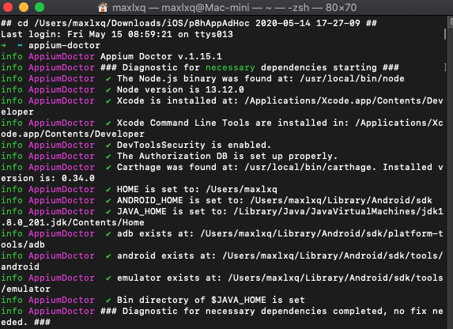
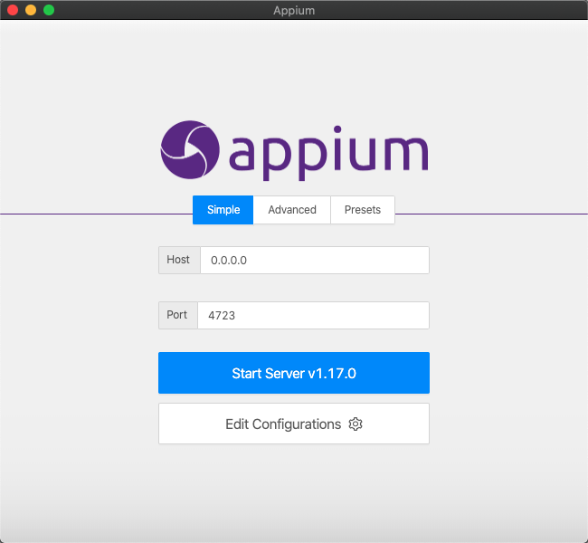
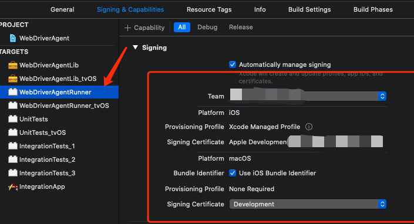
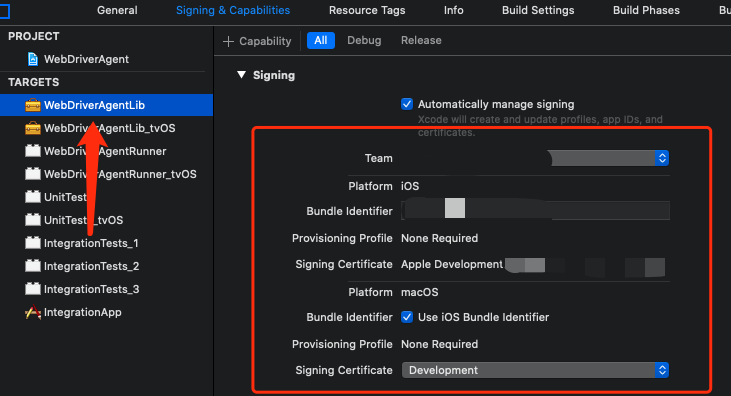
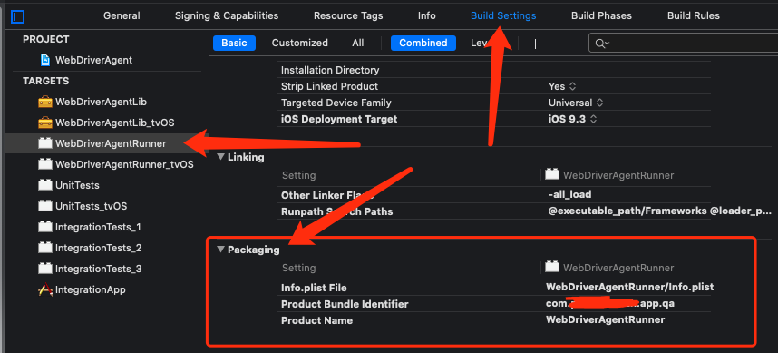
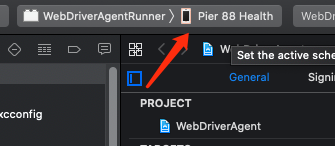

## Appium Desktop配置使用


Appium 是一款用于测试 Mobile App 的开源自动化测试框架。它是通过使用 WebDriver[Facebook开源] 协议来测试 iOS，Android  App 的。


#### 0 基础环境配置

iPhone 8 Plus		 :	13.2.3

Mac OS					:	10.15.4

Xcode				   	:	11.4.1

Appium-Desktop	:	1.17.0

Appium 无界面版	:	1.15.1

Node.js					 :	13.12.0 // brew install node

JDK							 :	1.8.0_201-b09

Homebrew				:	2.2.16


```shell
brew install libimobiledevice --HEAD
brew install carthage
yarn global add ios-deploy
gem install xcpretty

yarn global add appium-doctor
yarn global add appium
```


#### 1 Appium Desktop 安装

[点击此处下载 Appium-mac-1.17.0.dmg](https://github.com/appium/appium-desktop/releases/download/v1.17.0/Appium-mac-1.17.0.dmg)

安装Appium-mac-1.17.0.dmg，安装后应用程序中出现一个 Appium.app 应用。

```shell
// 查看配置
appium-doctor
```



打开Appium，看到如下页面




#### 2 项目配置

在`/Applications/Appium.app/Contents/Resources/app/node_modules/appium/node_modules/appium-webdriveragent/`路径下执行`./Scripts/bootstrap.sh `

找到此路径下`WebDriverAgent.xcodeproj`，用Xcode打开

配置**WebDriverAgentLib**和**WebDriverAgentRunner**的证书

填写好`Bundle Identifier`：为你要测试的APP的Bundle ID，具体问开发要，不同APP对应不同ID

```json
{
  QA: com.pier88health.app.qa,
  Dev: com.pier88health.app.dev,
  Stg: com.pier88health.app.staging,
  Prod: com.pier88health.app,
}
```


选择自己的Team或者个人开发者账号，然后点击最上面`Automatically manage signing`，等待一会即可







用数据线连接自己的iOS设备，选择自己的设备【最顶部那台】，然后执行cmd + u 或者 点击 最上方Product --> Test，即可运行成功。



设置Appium


确保第二步Xcode配置完成，然后点击Start Session，运行成功后，弹出一个控制界面，可以控制手机上正在运行的程序


界面上具体功能，需要继续研究


引用参考文章：

[Appium 自动化测试的学习](https://www.jianshu.com/p/1cd188457bf4)