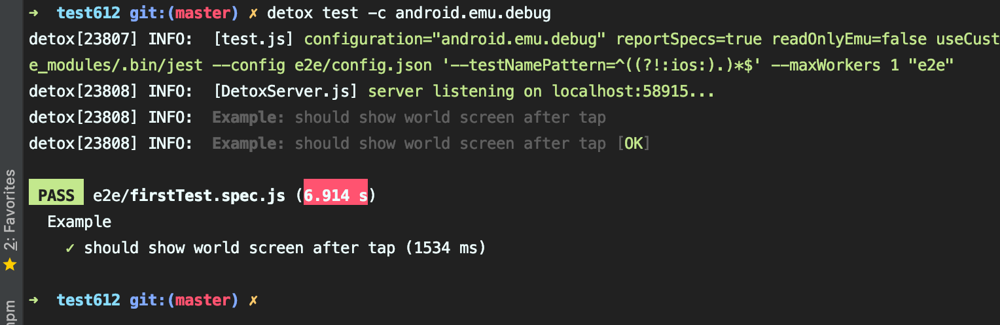

### Detox 配置

新项目创建，添加使用，10分钟内可以配置完成并编写测试用例

#### iOS配置

具体配置如下，[参考链接](https://github.com/wix/Detox/blob/master/docs/Introduction.GettingStarted.md)

```shell
#全局安装，默认已经安装好了node, homebrew等必要工具

brew tap wix/brew
brew install applesimutils

yarn global add detox-cli

# 打开rn项目
yarn add detox --dev

# 配置package.json 尾部添加
{
	...
	"detox": {
  	"configurations": {
      "ios.sim.debug": {
        "binaryPath": "ios/build/Build/Products/Debug-iphonesimulator/p8hApp.app",
        "build": "xcodebuild -workspace ios/p8hApp.xcworkspace -scheme p8hAppDev -configuration Debug -sdk iphonesimulator -derivedDataPath ios/build",
        "type": "ios.simulator",
        "device": {
          "type": "iPhone 11 Pro Max"
        }
      }
    }
	}
}

# 安装jest or mocha
yarn add jest --dev

# detox 初始化 jest 配置和测试用例demo
detox init -r jest

# build一个iOS的APP文件
detox build -c ios.sim.debug

# detox 执行测试用例
detox test -c ios.sim.debug
```

案例


#### Android 配置

Add the file `android/app/src/androidTest/java/com/[your.package]/DetoxTest.java`

```
// your package name
package com.test612; // 修改成你自己的 package name，如项目名 project，即：package com.project

import com.wix.detox.Detox;

import org.junit.Rule;
import org.junit.Test;
import org.junit.runner.RunWith;

import androidx.test.ext.junit.runners.AndroidJUnit4;
import androidx.test.filters.LargeTest;
import androidx.test.rule.ActivityTestRule;

@RunWith(AndroidJUnit4.class)
@LargeTest
public class DetoxTest {

    @Rule
    // Replace 'MainActivity' with the value of android:name entry in
    // <activity> in AndroidManifest.xml
    public ActivityTestRule<MainActivity> mActivityRule = new ActivityTestRule<>(MainActivity.class, false, false);

    @Test
    public void runDetoxTests() {
        Detox.runTests(mActivityRule);
    }
}
```


In your app's buildscript (i.e. `app/build.gradle`) add this in `dependencies` section:

```
dependencies {
	  // ...
    androidTestImplementation('com.wix:detox:+')
    
    // ...
}
```

In your app's buildscript (i.e. `app/build.gradle`) add this to the `defaultConfig` subsection:

```
android {
  // ...
  
  defaultConfig {
      // ...
      testBuildType System.getProperty('testBuildType', 'debug')  // This will later be used to control the test apk build type
      testInstrumentationRunner 'androidx.test.runner.AndroidJUnitRunner'
  }
  
  packagingOptions {
  exclude 'META-INF/DEPENDENCIES'
  exclude 'META-INF/NOTICE'
  exclude 'META-INF/LICENSE'
  exclude 'META-INF/LICENSE.txt'
  exclude 'META-INF/NOTICE.txt'
  }
}
```

If your project does not already support Kotlin, add the Kotlin Gradle-plugin to your classpath in the root build-script (i.e.`android/build.gradle`):

```
buildscript {
    // ...
    ext {
      buildToolsVersion = "29.0.3"
      minSdkVersion = 18
      compileSdkVersion = 29
      targetSdkVersion = 29

    	kotlinVersion = '1.3.70'
    }

    dependencies {
        // ...
        classpath "org.jetbrains.kotlin:kotlin-gradle-plugin:$kotlinVersion"
    }
}

allprojects {
	repositories {
		// ...
    maven {
      // All of Detox' artifacts are provided via the npm module
      url "$rootDir/../node_modules/detox/Detox-android"
    }
	}
}
```

Add this part to your `package.json`:

```
"detox" : {
    "configurations": {
        "android.emu.debug": {
            "binaryPath": "android/app/build/outputs/apk/debug/app-debug.apk",
            "build":
            "cd android && ./gradlew assembleDebug assembleAndroidTest -DtestBuildType=debug && cd ..",
            "type": "android.emulator",
            "device": {
              "avdName": "Pixel_3_API_29" // 模拟器
            }
        },
        "android.emu.release": {
            "binaryPath": "android/app/build/outputs/apk/release/app-release.apk",
            "build": "cd android && ./gradlew assembleRelease assembleAndroidTest -DtestBuildType=release && cd ..",
            "type": "android.emulator",
            "device": {
              "avdName": "Pixel_3_API_29"
            }
        }
    }
}
```


Build app

```
detox build -c android.emu.debug
```

Run test

```
detox test -c android.emu.debug
```


案例




Detox Action

[操作API](https://github.com/wix/Detox/blob/master/docs/APIRef.ActionsOnElement.md)