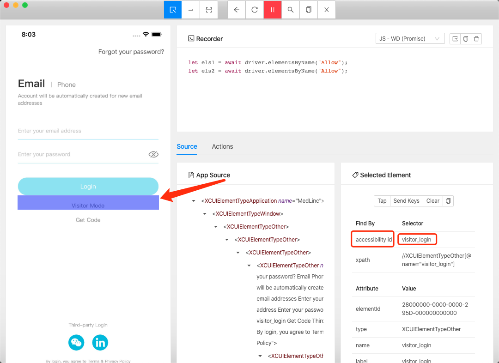

自动化测试流程


脚本打包，并将app文件添加到zip中，形成固定链接

启动Xcode执行Test

完善配置文件，执行测试脚本，每次执行时都是重新安装APP，所以无法测试升级问题

最后得到测试结果输出，产生测试用例结果文件进行分析

```shell
# 执行命令
jest <testFile> --outputFile=<result.json> --json
```

执行两次结果如下，调参得到：两个用例一次通过一个，一次完全通过


编写测试用例

脚本打包，iOS 暂未尝试ipa是否可以直接测试，Android可以直接测试

```javascript
{
	ios			: xcodebuild -workspace ios/<ProjectName>.xcworkspace -scheme <ProjectName> -configuration [Debug|Release] -sdk iphonesimulator -derivedDataPath ios/build,
	android	: 正常打包，release pgy的即可
}
```


将app文件添加到zip中，形成固定链接

启动Xcode执行Test

完善配置文件，启动Appium Desktop，可以在界面中编写测试用例


搜索后，找到节点，选中后点击Tap Element


选中界面上某些元素，然后看到最右侧被选中元素的`accessibility id`[如果设置了就可以看到]



点击上方 🔍 图标，选择`Accessibility ID`，并输入值：`visitor_login`


查询得到节点结果，选中节点，并点击`Tap Element`


登陆之后，手动刷新页面，即可同步手机中最新页面，在Recorder中可以看到自动生成的测试用例代码，按照规范更改后即可在测试项目中使用


后续相同处理

